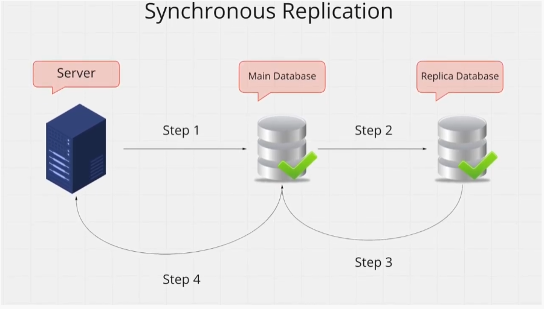
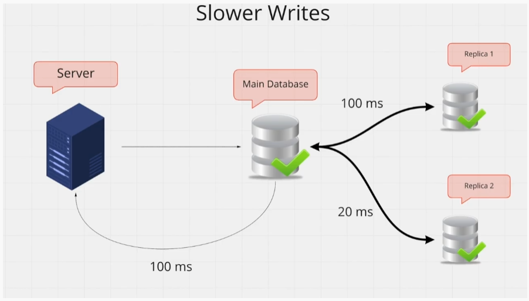
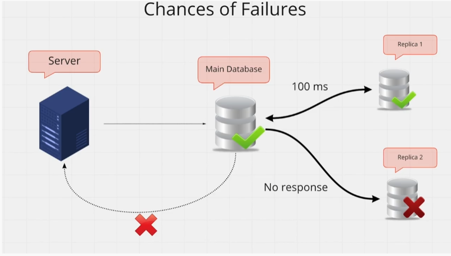
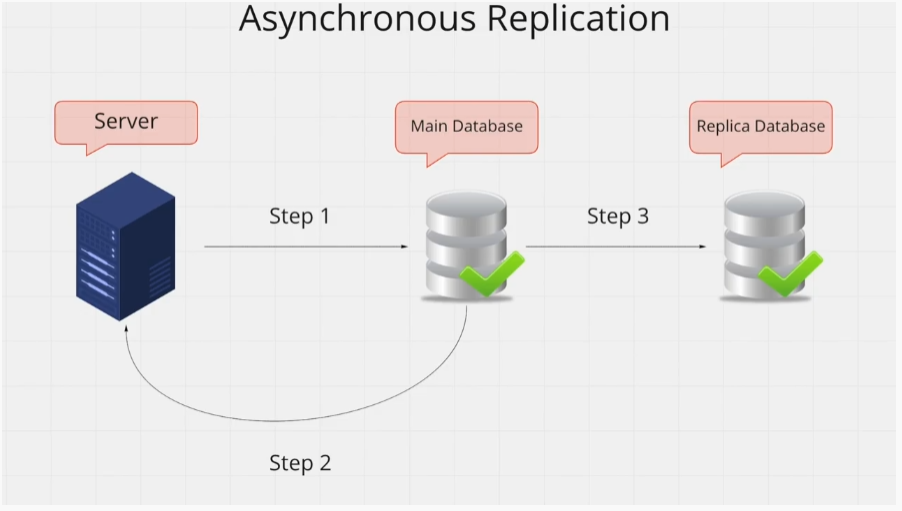
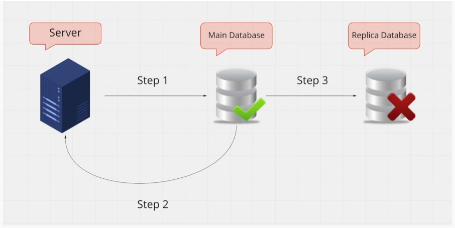

# Database Replication 

#### Database Replication means Retaining Multiple Copies of the Same Data. 

#### You keep the SAME DATA in Multiple Databases

#### These databases that keep copies of your data are called "Replica"

You can **read** data from **replicas** 

You can also **recover** data from replicas if your **master** database gets destroyed. 

Example: 

- User submits a form to the Server. 

- Server then writes the data to the Main Database (so that its persistent). 

- This is where replication kicks in. Lets say we have two more Replica Databases. 

- Our Main Database will also write the data to the two Replica Databases **in different machines**.

- **Now all three Databases will have the User's information.**

## Why do we need Database Replication ?

There are three reasons: **Lower Latency**, **Keep Data Close To Users** and **Data Safety**. 

### 1. Lower Latency 

**Since we have multiple machines to read data from, we dont' have to worry about our one Master Database getting bombarded with requests during high traffic.**

**The traffic will be distributed among all the Replicas.**

#### Thus Requests will have Less Latency, as they don't rely on on Master DB to serve all requests.

### 2. Keeping Data Close To Users 

Lets say we have three Users in **different locations** (Asia, Europe and USA)

We can keep our DB Replicas at these locations (Asia, Europe and USA)

Users can read from the Database that's **Geographically Closest** to them. 

**This also Reduces Latency.** 

### 3. Data Safety 

Lets say the warehouse where our Master Database is **gets destroyed** in fire.

Having a Replica means we can **Quickly Recover** all our data and function at full strength as if the castrastophe never happened. 

## Two Types Of Replications 

**Synchronous** and **Asynchronous** Replication

### 1. Synchronous Replication

- Your Server writes to the **Main Database**. 

- The Main Database then writes to **Replica Database**.

- The **Replica DB** then **sends acknowledgement** back to Main DB, confirming that it wrote the data safely. 

- Finally the Main DB tells your Server that the **write was successful**.

- Now both **Main** and **Replica** will have the **SAME DATA**.

- NOTE that the **Write is Blocking** in nature here. 
    - Server has to **wait** till both Main and Replica have written the data and send back response of sucessful write. 
    - This leads to **less performance**.

#### Two Problems with Synchronous Replication:

**Slower Writes** and **Chances Of Failures**. 

1. **Slower Writes**

- The Server **has to wait** before the replicas have confirmed that they wrote that data correctly. 

- This means your **write performance suffers**. 

- If Main (USA) and Replicas (Asia and Europe) are at different locations, this **Latency can be quite High**. 

- Our Server will still have to wait > 100ms (Asia) before it can move on to next request. 

2. **Chances Of Failures**

- An **even bigger problem** is the Chances of Failure. 

- Say if one of two Replicas **is down** for some reason and it cannot acknowledge.

- In that case the **Whole Write Operation Fails**. We dont' consider that a successful write, so data is **not persisted**.

#### Synchronouse Replication is More Reliable because of this. 

#### We know for sure if all Replicas are consistent with each other or not. 

### 2. Asynchronous Replication 

- Your Server **Writes** to the **Main Database**. 

- Main Database **immediately tells** the Server that the **write was successful**. 

- After that, the Main Database **writes** data to the **Replicas** **without needing any acknowledgements**.

- The Write to the DBs here is **Not Blocking**.

- Server can move on serving other requests as soon as Main DB has acknowledged the write. 

- **Replication is done in the Background**.

- This has much **better write performance**.

- This DOES have **Data Inconsistency**. 

#### One Problem With Asynchronous Replication 

**Data Loss**

1. **Data Loss** 

- If **Replica DB** is **down** when the write happens.

- Now your **Main DB** will have the data, but the **Replica** **wont**.

- We **cannot be sure** if all Replicas have written the data successfully. Different Replicas might have different data missing. 

