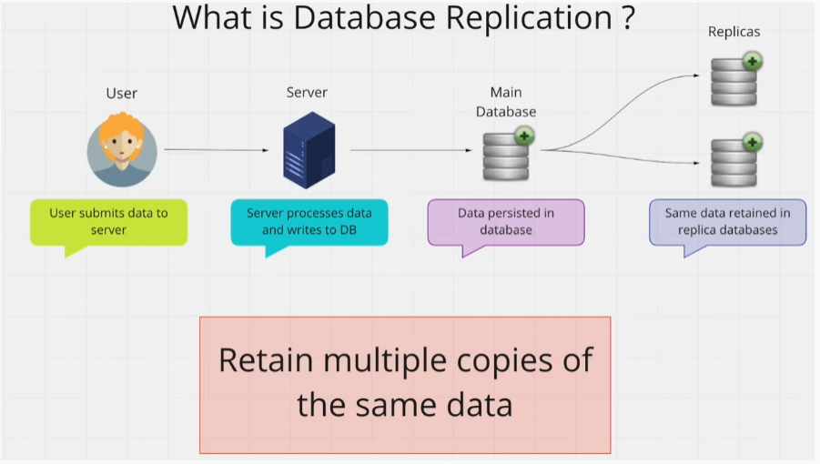

# Database Replication 

#### Database Replication means Retaining Multiple Copies of the Same Data. 

#### You keep the same data in Multiple Databases

#### These databases that keep copies of your data are called "Replica"

You can **read** data from **replicas** 

You can also **recover** data from replicas if your **master** database gets destroyed. 

