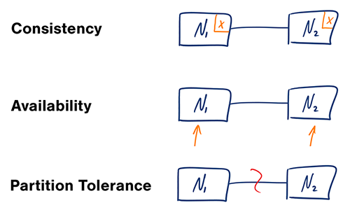

# CAP Theorem

- In a **distrubuted computer system**, you can only support two of the following gurantees: 
    
    1. **Consistency** - Every read receives the **most recent write or an error**. 

    2. **Availability** - Every request receives a response, **without guarantee** that it constains the most recent version of the information.

    3. **Partition Tolerance** - The system **continues to operate despite** arbitrary **partitioning dues to network failures**. 

- You can either have **CP** or **AP**.
 
- **AP** is a good choice if the business needs allow for **eventual consisteny** or when system needs to continue **working despite external errors**.

## Consistency Patterns 

With multiple copies of the same data, we are faced with options on **how to synchronize** them so clients have a **consistent view of the data**.

### 1. Weak Consistency 

- **After a write, reads may or may not see it**. A best effort approach is taken.  

- This approach is seen in systems such as memcached. 

- Weak consistency works well in real time use cases such as VoIP, video chat, and realtime multiplayer games. 

- For example, if you are on a phone call and lose reception for a few seconds, when you regain connection you do not hear what was spoken during connection loss.

### 2. Eventual Consistency 

- **After a write, reads will eventually see it** (typically within milliseconds)

- Data is **replicated asynchronously**. (See DB Replication)

- This approach is seen in systems such as DNS and email.

- Eventual consistency works well in **highly available systems**.

### 3. Strong Consistency 

- **After a write, reads will see it**. 

- Data is **replicated synchronously**. 

- This approach is seen in file systems and RDBMSes. 

- Strong consistency works well in **systems that need transactions**.

## Availability Patterns

There are two **complementary** patterns to support high availability: **Fail-Over** and **Replication**. 

### 1. Fail-Over 

Fail-Over is of two types: **Active-Passive** and **Active-Active** 

#### a. Active-Passive: 

- With active-passive fail-over, **heartbeats are sent between the active and the passive server on standby**.

- If the **heartbeat is interrupted**, the **passive server takes over active's IP address** and **resumes service**. 

- The **length of downtime** is determined by **whether the passive server is already running in 'hot' standby** or **whether it needs to start up from 'cold' standby**. 

- Only the active server handles traffic.

#### b. Active-Active 

- In active-active fail-over, **both servers are managing traffic**, spreading the load between them. 

- If the servers are **public-facing**, the DNS would need to know about the public IPs of both servers. 

- If the servers are **internal-facing**, application logic would need to know about both servers. 

- Active-Active fail-over can also be reffered to as **Master-Master fail-over**.

#### Disadvantages (Fail-Over)

- Fail-over adds **more hardware** and **complexity**. 

- There is a **potential for loss of data** if the **active system fails before any newly written data can be replicated** to the passive. 

### 2. Replication

Replication is of two types: **Master-Slave** and **Master-Master**

#### a. Master-Slave 

- In master-slave replication, The **master serves reads and writes, replicating writes to one or more slaves, which serve only reads**. 

-  Slaves can also **replicate to additional slaves in a tree-like fashion**.

- If the **master goes offline**, the system can continue to **operate in read-only mode until a slave is promoted to a master** or a new master is provisioned.

- **Disadvantages**
    - Additional logic is needed to promote a slave to a master. 

#### b. Master-Master 

- In master-master replication, The **masters serve reads and writes and coordinate with each other on writes**. 

- If **either master goes down**, the system can continue to **operate with both read and writes**. 

- **Disadvantages** 
    - You'll **need a load balancer** or you'll need to make changes to your appliation logic **to determine where to write**. 

    - Most master-master systems are either **loosely consistent** (violating **ACID**) or have **increased write latency due to synchronization**. 

    - **Conflict resolution** comes more into play **as more write nodes are added** and **as latency increases**.

#### Disadvantages (Replication)

- There is a **potential for loss of data** if the **master fails** before any newly written data can be replicated to other nodes. 

- **Writes are replayed to the read replicas**. If there are a lot of writes, **the read replicas can get bogged down** with replaying writes and **can't do as many reads**.

- The **more read slaves, the more you have to replicate**, which leads to **greater replication lag**. 

- On some systems, **writing to the master can spawn multiple threads** to write in **parallel**, whereas **read replicas only support writing sequentially** with a **single thread**.

_See DNS Next_