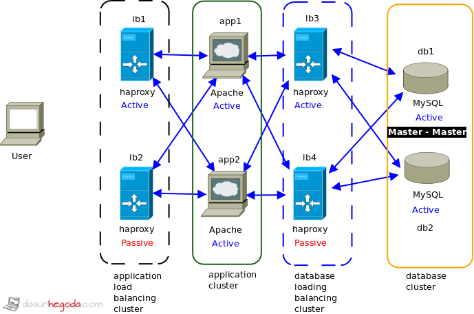

# Avoiding Single Points Of Failures 

### Single Points Of Failures (SPOF) are those points where the Entire System can crash incase that point crashes. 

Example: Lets say your single **Web Server** crashes, then your entire system goes down. 

If your **Architecture** has a **Single Point Of Failure** that means your architecture is **not Resilient**. 

#### The most simple way of mitigating SPOF is to "Add Another Node".

### What if your Service (API Server) goes down ? 

**Horizontally Scaling** by adding more **nodes** or **instances** of the **Service** (**API Server**) should **mitigate** the SPOF. 

Example: your Read API should have multiple instances running. 

This introduces a need for a **Load Balancer** to balance load among multiple instances of the **Service**. 

A **single Load Balancer** is another **Single Point Of Failure**. 

### What if your Load Balancer goes down ? 

You need **Multiple Load Balancers**. Simple Horizontally Scale your Load Balancers as well. 

Now the **client may not know wich load balancer to connect with**. 

**The Client** is going to connect to the **DNS (Domain Name System)**, the **DNS** has **multiple IP records for the same address/host**.

Example: You hit _www.facebook.com_ on your browser, The DNS will return **multiple IP addresses** any one of which will be okay to connect to facebook. Each IP just points to a different **Load Balancer**

**DNS** server can continuously **ping** the **Load Balancers** to check if they are UP. 

**HAProxy** is a famouse **Load Balancer** plus **Reverse Proxy**. 

### What if your Database goes down ?

You should keep another Database **Replica** just in case. 

The **Replica** can either be Active (**Master-Master**) or on stand-by (**Master-Slave**)

_See Fail-Over in CAP Theorem_

You can also have **Multiple Replicas** just for **Read Operations**, these are known as **Read-Replicas**. 

**Master-Slave** is more suited to **Write-Only** Database instances. 

NOTE: **DB Partitioning (Federation, Sharding etc)** does **not** deal with single point of failure, they are rather used to **reduce latency.**

### Can something else go down ? What if the Region goes down ?

If the **Entire System** is **located in one place** will possibly fail if there some disaster in that region and the server ecosystem goes down. 

Example: Say AWS California is down due to Hurricane.

To **mitigate** this, just have your system available in **Multiple Regions**

### What if your Global Cache goes down ? 

Just scale that **Horizontally too**, and add a **load balancer** in front of them. 

