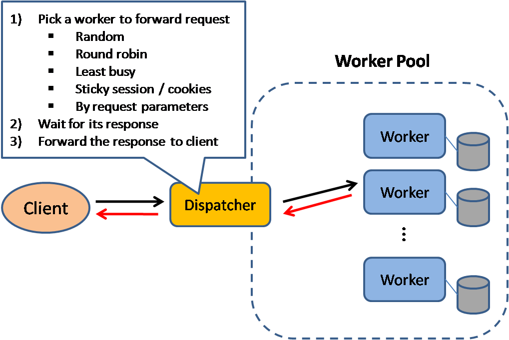

# Load Balancer 

Load Balancers **Distribute Incoming Client Requests** to computing resources such as **Application Servers and Databases**. 

In each case, the load balancer **returns the response from the computing resource to the appropriate client**.  

Load Balancers are effective at: 

1. **Preventing requests from going to unhealthy servers.** 

2. **Preventing overloading resources.** 

3. **Helping to eliminate a single point of failure.** 

Load Balancers can be implemented with **hardware (expensive)** or with **software such as HAProxy**.

Additional benefits include: 

1. **SSL Termination** - Decrypt incoming request and ecrypt responses. So backend servers do not have to perform these pothentially expensive operations. 

2. **Session Persistence** - Issue cookies and route a specific client's requests to same instance if the web apps do not keep track of sessions. 

**To protect against failures**, it's common to set up **multiple load balancers**, either in **active-passive** or **active-active** mode. (See CAP Theorem)

#### Load balancers can route traffic based on various metrics, including: 

- **Random** 
- **Least Loaded** 
- **Session/Cookies** 
- **Round-Robin OR Weighted-Round-Robin** 
- **Layer 4** 
- **Layer 7** 

_See Scalability -> Load-Balancers_ 

_See Layers Of OSI Model (Open Systems Interconnection)_

### Layer 4 Load Balancing 

- Layer 4 load balancers **look at info at the Transport Layer** to decide how to destribute requests. 

- Generally, this involves the **source**, **destination IP addresses**, and **ports in the header**, but **NOT the contents** of the packet.  

- Layer 4 load balancers **forward network packets to and from the upstream server**, performing **Network Address Translation (NAT)**.

### Layer 7 Load Balancing 

- Layer 7 load balancers **look at the Application Layer** to decide how to distribute requests.  

- This can involve **contents of the header**, **message**, and **cookies**. 

- Layer 7 load balancers **terminate network traffic, reads the message, make a load-balancing decision, then opens a connection to the selected server**. 

- For example: a layer 7 load balancer can **direct video traffic to servers that host videos while directing more sensitive user billing traffic to security-hardened servers**. 

At the cost of **flexibility**, layer 4 load balancing **requires less time and computing resources** than layer 7 
    - Although performance impact can be minimal on modern commodity hardware. 

### Horizontal Scaling 

- Load balancers can also help with horizontal scaling, **improving performance** and **availablity**.

- Scaling out using commodity machines is **more cost efficient** and results in **higher availablility** than scaling up a single server on more expensive hardware (**vertical scaling**)

- It is also easier to hire for talent working on commodity hardware than it is for specialized enterprise systems. 

#### Disadvantages (Horizontal Scaling)

- Scaling horizontally **introduces complexity** and **involves cloning servers**. 
    - Servers **should be stateless**: they should **not contain any user-related data like sessons or profile pictures**. 

    - **Sessions can be stored in a centralized data store** such as a **databse (SQL, NoSQL)** or a **persitent cache (Redis, Memcached)**.

- Downstream servers such as caches and databases need to handle more simultaneous connections as upstream servers scale out. 

_See what is a Downstream Service_

### Disadvantages (Load Balancer) 

- The load balancer **can become a performance bottleneck if it does not have enough resources** or if it is **not configured properly**.

- Introducing a load balancer **to help eliminate a single point of failure** results in **increased complexity**.

- A **single load balancer** is **a single point of failure**, configuring **multiple load balancers furthur increases complexity**.

_See NGINX Also_

_See Reverse Proxy Next_