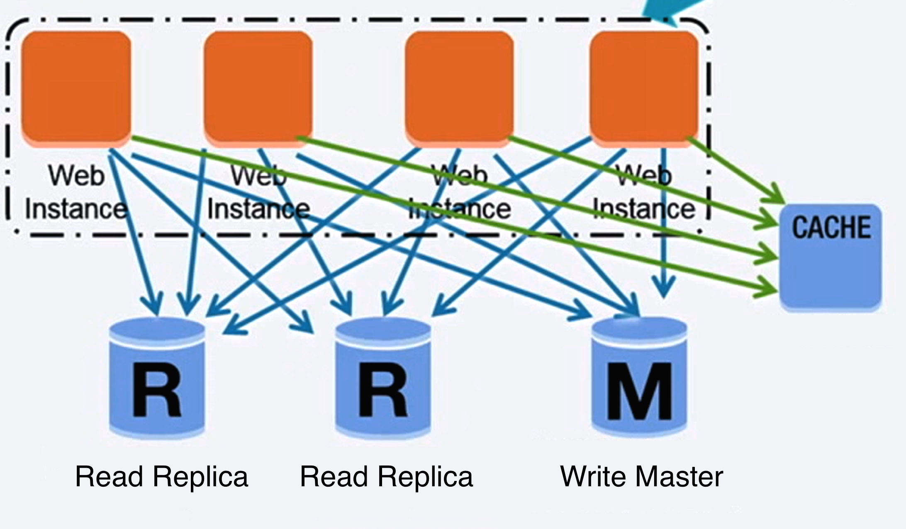

# Relational Database Management System (RDBMS)

A relational database like **SQL** is a collection of data items organized in tables. 

**ACID** is a set of properties of relational database **transactions**. 

1. **Atomiciy** - Each transaction is **all or nothing**. 

2. **Consitency** - Any transaction will bring the database from **one valid state** (consistent) **to another**. 

3. **Isolation** - Executing **transactions concurrently** has the **same results** as if the transactions were **executed serially**.

4. **Durability** - Once a transaction has been committed, it will remain so. 

There are many techniques to scale a relational database: 
- **Master-Slave Replication** 
- **Master-Master Replication** 
- **Federation** 
- **Sharding** 
- **Denormalization** 
- **SQL Tuning** 

_See CAP Theorem also_

_See Replication Next_