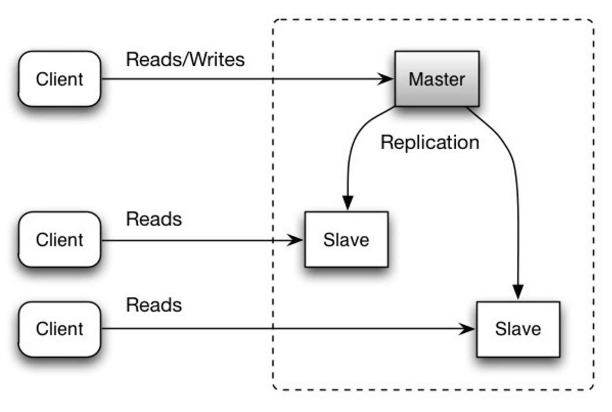

### 2. Replication

Replication is of two types: **Master-Slave** and **Master-Master**

#### a. Master-Slave Replication

- In master-slave replication, The **master serves reads and writes, replicating writes to one or more slaves, which serve only reads**. 

-  Slaves can also **replicate to additional slaves in a tree-like fashion**.

- If the **master goes offline**, the system can continue to **operate in read-only mode until a slave is promoted to a master** or a new master is provisioned.

- **Disadvantages**
    - Additional logic is needed to promote a slave to a master. 

#### b. Master-Master 

- In master-master replication, The **masters serve reads and writes and coordinate with each other on writes**. 

- If **either master goes down**, the system can continue to **operate with both read and writes**. 

- **Disadvantages** 
    - You'll **need a load balancer** or you'll need to make changes to your appliation logic **to determine where to write**. 

    - Most master-master systems are either **loosely consistent** (violating **ACID**) or have **increased write latency due to synchronization**. 

    - **Conflict resolution** comes more into play **as more write nodes are added** and **as latency increases**.

#### Disadvantages (Replication)

- There is a **potential for loss of data** if the **master fails** before any newly written data can be replicated to other nodes. 

- **Writes are replayed to the read replicas**. If there are a lot of writes, **the read replicas can get bogged down** with replaying writes and **can't do as many reads**.

- The **more read slaves, the more you have to replicate**, which leads to **greater replication lag**. 

- On some systems, **writing to the master can spawn multiple threads** to write in **parallel**, whereas **read replicas only support writing sequentially** with a **single thread**.

_See Federation Next_