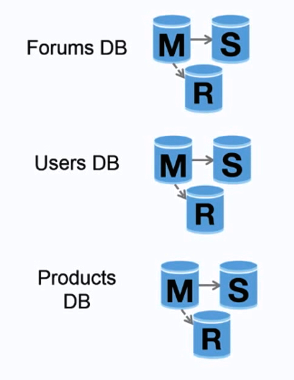

# Federation 

Federation (or **Functional Partitioning**) **splits up databases by function**.  

For example, instead of a **single, monolithic** database, you could have three databases: **forums**, **users**, and **products**, resulting in **less read and write traffic to each database** and therefore **less replication lag**.  

Smaller databases result in more data that can fit in memory, which in turn results in **more cache hits due to imporved cache locality**.

With no single central master serializing writes you can **write in parallel, increasing throughput**. 

### Disadvantages (Federation)

- Federation is **not effective if your schema requires huge functions or tables**. 

- You'll need to **update your application logic to determine which database to read and write**. 

- Joining data from two databases is **more complex with a server link**. 

- Federation adds more hardware and additional complexity. 

_See Sharding Next_