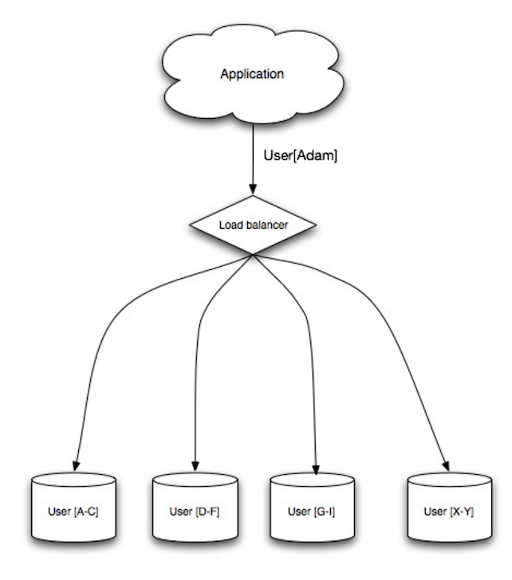

# Sharding 

Sharding **distributes data across different databases** such that **each database can only manage a subset of data**. 

Taking a users database as example, **as the number of users increase, more shards are added to the cluster**.

Similar to the advantages of **federation**, sharding results in **less read and write traffic**, **less replication**, and **more cache hits**. 

Index size is also reduced which generally improves performance.

**If one shard goes down, the other shards are still operational**, although you'll want to add some form of **replication to avoid data loss**.

Like **federation**, there is **no single central master serializing writes**, allowing you to **write in parallel with increased throughput**. 

Common ways to shard a table of users is either through user's last name initial or the user's geographic location. 

### Disadvantages (Sharding)

- You'll need to **update your application logic to work with shards**, which could result in **complex SQL queries**. 

- **Data disribution can become lopsided in a shard**. 
    - For example, a set of power users (celebrity) on a shard could result in increased load to that shard compared to others. 
    - Rebalancing adds additional complexity. A sharding function based on **consitent hashing** can reduce the amount of transferred data. 

- **Joining data from multiple shards is more complex**.

- Sharding adds **more hardware and additional complexity**. 

_See Denormalization Next_