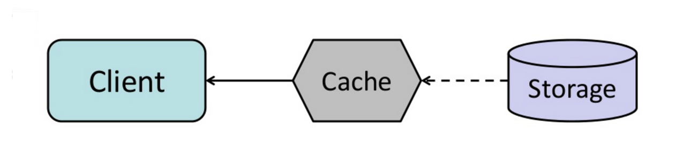

# Cache 


Caching **improves page load times** and can **reduce the load on your servers and databases**. 

In this model, the **dispatcher will first lookup if the request has been made before** and **try to find the previous result** to return, in order to save the actual execution. 


Databases often benefit from a uniform distribution of reads and writes across its partitions. 

Popular items can **skew the distribution**, causing **bottlenecks**.

**Putting a cache in front of a database can help absorb uneven loads in spikes in traffic**. 


### Client Caching 

Caches can be located on the **client side (OS or browser)**, **server side**, or in a **distinct cache layer (global cache)**.


### CDN Caching 

**CDNs** are considered **a type of cache**.


### Web Server Caching 

**Reverse Proxies** and caches such as **Varnish** can serve static and dynamic content directly. 

**Web servers can also cache requests**, returning responses without having to contact application servers. 


### Database Caching 

**Your database usually includes some level of caching in default configuration**, optimized for a generic use case. 

Tweaking these settings for specific usage patterns can furthur boost performance. 


### Application Caching 

**In-memory caches** such as **Memcached** and **Redis** are key-value stores between your application and your data storage. 

**Since the data is held in RAM, it is much faster than typical databases where data is stored on disk**. 

RAM is more limited than disk, so **cache invalidation** algorithms such as **Least Recently Used (LRU)** can help invalidate **'cold'** entries and keep **'hot'** data in RAM. 


**Redis has the following additional features:**

1. Persitence option 
2. Built-in data structures such as sorted sets and lists. 


There are multiple levels you can cache that fall into two general categories: **database queries** and **objects**

1. Row Level 
2. Query-Level 
3. Fully-Formed Serializable Objects 
4. Fully-Rendered HTML


**Generally, you should try to avoid file-based caching, as it makes cloning and auto-scaling more difficult**. 


### Caching At The Database Query Level 

Whenever you query the database, **hash the query as a key and store the result to the cache**.

This approach suffers from expiration issues: 

- Hard to delete a cached result with complex queries. 
- If one piece of data changes such as a table cell, you need to delete all cached queries that might include the changed cell. 


### Caching At The Object Level 

See your data as an object, similar to what you do in your application code. 

Have your application assemble the dataset from the database into a class instance or a data structure(s): 

- Remove teh object from cache if its underlying data has changed. 
- Allows for asynchronous processing: workers assemble objects by consuming the latest cached object. 

*Suggestions of what ot cache*:

1. User Sessions 
2. Fully Rendered Web Pages 
3. Activity Streams 
4. User Graph Data 


## When To Update The Cache 

Since you can only store a limited amount of data in cache, you'll need to determine which cache update strategy works best for your use case. 


### 1. Cache-Aside


The application is responsible for reading and writing from storage. **The cache does not interact with storage directly**. 

The application does the following: 

1. Look for entry in cache, resulting in a cache miss. 
2. Load entry from the database 
3. Add entry to the cache 
4. Return entry

``` python
def get_user(self, user_id):
    user = cache.get("user.{0}", user_id)
    if user is None:
        user = db.query("SELECT * FROM users WHERE user_id = {0}", user_id)
        if user is not None:
            key = "user.{0}".format(user_id)
            cache.set(key, json.dumps(user))
    return user
```

**Memcached** is generally used in this manner. 

Subsequent reads of data added to cache are fast. 

*Cache-aside is also referred to as __lazy loading__*. 

Only requested data is cached, which avoids filling up the cache with data that isn't requested.


#### Disadvantages (Cache-Aside)

- Each cache miss results in three trips, which can cause a noticeable delay.

- **Data can become stale** (in cache) if it is updated in the database. This issue is mitigated by setting a **time-to-live (TTL)** which forces an update of the cache entry, or by using write-through.

- When a node fails, it is replaced by a new, empty node, increasing latency.


### 2. Write-Through


The application uses the **cache as the main data store**, reading and writing data to it, while the **cache is reponsible for reading and writing to the database**. 

1. Application add/updates entry in cache.
2. Cache synchronously writes entry to the data store. 
3. Return (to user)

Application Code: 
```python 
set_user(12345, {"foo":"bar"})
```

Cache code:
```python
def set_user(user_id, values):
    user = db.query("UPDATE Users WHERE id = {0}", user_id, values)
    cache.set(user_id, user)
```

**Write-through is a slow overall operation** due to the write operation, but subsequent reads of just written data are fast. 

Users are genrally more tolerant of latency when updating data than reading data. 

**Data in the cache is not stale**. 


#### Disadvantages (Write-Through)

- When a new node is created due to failure or scaling, the new node will not cache entries until the entry is updated in the database. **Cache-Aside in conjuction with Write-Through** can mitigate this issue. 

- Most data written might never be read, which can be minimized with **TTL**. 


### 3. Write-Behind (Write-Back)


In write-behind, the application does the following: 

1. **Add/Update entry in cache**. 

2. **Asynchronously write entry to the data store, improving write performance.** 


#### Disadvantages (Write-Behind)

- **There could be data loss** if the cache goes down prior to its contents hitting the data store. 

- It is more **complex to implement** write-behind than it is to implement cache-aside or write-through. 


### 4. Refresh-Ahead 




You can **configure the cache to automatically refresh any recently accessed cache entry prior to its expiration**. 


Refresh-ahead can **result in reduced latency** vs read-through if the cache can accurately predict which items are likely to be needed in the future. 


#### Disadvantages (Refresh-Ahead)

- **Not accurately predicting which items are likely to be needed in the future** can **result in reduced performance** than without refresh-ahead.


## Disadvantages (Cache)

- Need to maintain consistency between caches and the source of truth such as the database through **cache invalidation**. 

- Cache invalidation is difficult problem, there is **additional complexity associated with when to update the cache**. 

- Need to make application changes such as adding **Redis** or **Memcached**.


_See Asynchronism Next_