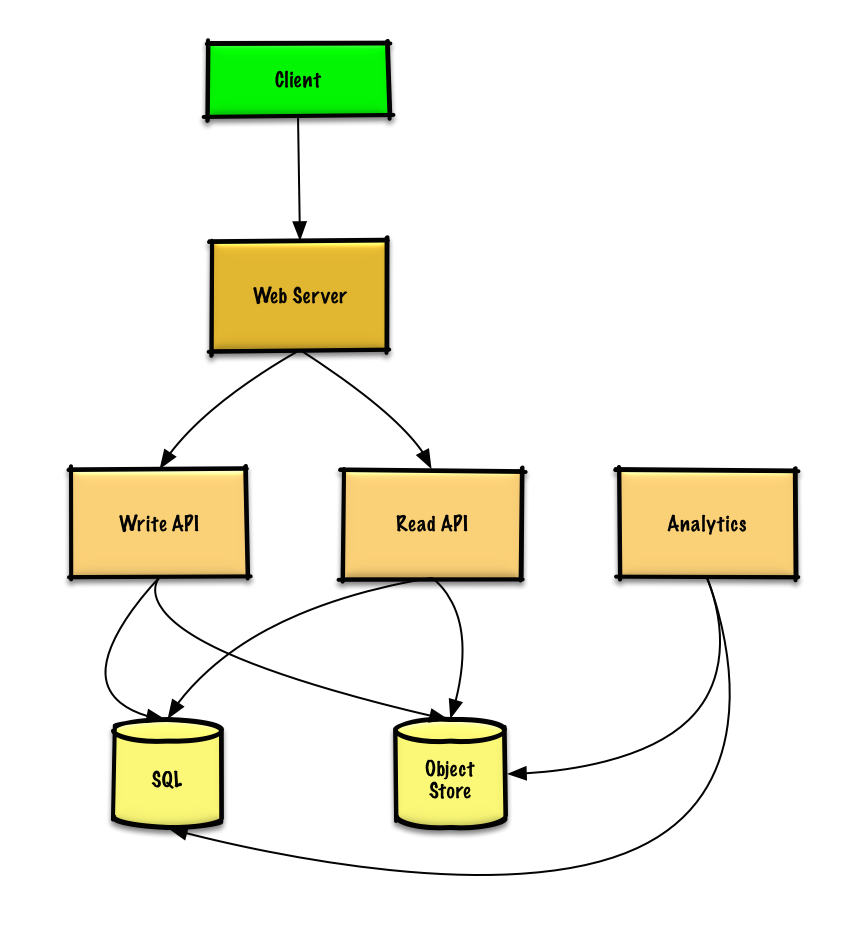

# Design Pastebin.com or Bit.ly

**Pastebin is a site where users can posts text blocks. Pastebin provides a link to that text block.** 

**Bit.ly is a url shortner, users post a url (which gets stored) and bit.ly provides a shortened url.**

## Step 1. Outline Use-Cases and Constraints. 

Always gather requirements and scope the problem. Ask the interviewer questions to **clarify use-cases and contraints**. 

Alos discuss assumptions with the interviewer. 

### Use Cases 

#### We'll scope the problem to handle only the following use cases. 

- **User** enters a block of text (or url) and gets a randomly generated link 
    - **Expiration** 
        - Default setting does not expire 
        - Can optionally set a timed expiration 

- **User** enters a paste's url and **views the content**. 

- **User** is anonymous 

- **Service** tracks **analytics** of pages 
    - Monthly visit stats 

- **Service** deletes expired pastes 

- **Service** has **high availability**. 

#### Out of scope 

- **User** registers for an account .
    - **User** verifies email. 

- **User** logs into a registered account 
    - **User** edits the document 

- **User** can **set visibility** 

- **User** can set the **shortlink**

### Constraints and Assumptions 

#### State Assumptions 

- Traffic is not evenly distributed. 
- Following a short link should be fast. 
- Pastes are text only. 
- Page view analytics do not need to be realtime 
- 10 million users 
- 10 million paste writes per month 
- 100 million paste reads per month 
- 10:1 read to write ratio

#### Calculate Usage 

**Clarify with your interviewer if you should run _back-of-the-envelope_ usage calculations.** 

1. Size per paste 
    - 1 KB content per paste 
    - **shotlink** - 7 bytes 
    - **expiration_length_in_minutes** - 4 bytes 
    - **created_at** - 5 bytes 
    - **paste_path** - 255 bytes 
    - total = **~1.27 KB per paste**

2. 12.7 GB of new paste content per month 
    - 1.27 KB per paste * 10 million pastes per month 
    - ~450 GB of new paste content in 3 years 
    - 360 million shortlinks in 3 years 
    - Assume most are new pastes instead of updates to existing ones.

3. 4 paste writes per second on average 

4. 40 read requests per second on average. 

## Step 2: Create a high-level design 

## Step 3 Design Core Components 

**Dive into details for each core component**. 

### Use Case: User enters a block of text and gets a randomly generated link 

We could use a **Relational Database** as a **large hash table**, mapping the **generated url to a file server** and path containing the paste file. 

Instead of managing a file server, we could use a **managed Object Store** such as **Amazon S3** or a **NoSQL document store**. 

An **alternative to realtional database acting as a large hash table**, we could use a **NoSQL key-value store**.

We should discuss the **tradeoffs between choosing SQL or NoSQL**. 

The folowing discusstion uses the relational database approach: 

- The **Client** sends a create paste request to the **Web Server**, running as a **reverse proxy**

-  The **Web Server** forwards the request to **Write API** server. 

- The **Write API** server does the following: 
    - Generates a unique url 
        - Checks if the url is unique by looking at the **SQL Database** for a duplicate. 
        - If the url is not unique, it generates another url. 
        - If we supported a custom url, we could use the user-supplied (also check for a duplicate)

    - Saves to the **SQL Database** _pastes_ table. 
    - Saves the paste data to the **Object Store**. 
    - Returns the url. 

**Clarify with interviewer how much code you are expected to write.**

The _pastes_ table could have the following structure: 
    
    shortlink char(7) NOT NULL 
    expiration_length_in_minutes int NOT NULL 
    created_at datatime NOT NULL 
    paste_path varchar(255) NOT NULL 
    PRIMARY KEY(shortlink)

Setting the primary key to be based on the **shortlink** column creates an **index** that the database uses to enforce uniqueness. 

We'll create an _additional index_ on **created_at** to speed up lookups (log-time instead of scanning the entire table) and to keep data in memory. 

Reading 1 MB sequentially from memory takes about 250 microseconds, while reading from SSD takes 4x and from Disk takes 80x longer. 

**To generate the unique url, we could:** 

- Take the **MD5** hash of the user's *ip_address* + timestamp.
    - **MD5** is a widely used hashing function that produces a 128-bit hash value. 
    - **MD5** is uniformly distributed. 
    - Alternativey, we could also take the MD5 hash of randomly-generated data. 

- **Base 62** encode the **MD5** hash 
    - **Base 62** encodes to [a-zA-Z0-9] which works well for urls, eliminating the need for escaping special characters. 
    - There is only one hash result for original input and Base 62 is deterministic (no randomness involved)
    - **Base 64** is another popular encoding but provides issues for urls because of additional **+** and **/** characters. 

- Take the **first 7 chracters** of the output, which results in **62^7 possible values** and should be sufficient to handle our contraint of 360 million shortlinks in 3 years: 

**REST API:** 
https://pastebin.com/api/v1/paste 
Body: {
    "expiration_length_in_minutes": "60" 
    "paste_contents:" "Hello World!", 
}

**Response:** 
{
    "shortlink": "foobar" 
}

**For internal communications, we could use **Remote Procedure Calls (RPC)**

### Use Case: User enters a paste's url and views the contents 

- The **Client** sends a get paste requests to the **Web Server** 
- The **Web Server** forwards the request to the **Read API** server. 
- The **Read API** server does the following: 
    - Checks the **SQL Database** for the generated url 
        - If the url is in the **SQL DB**, fetch the paste contents from the **Object Store** 
        - Else, return an error message for the user. 

**REST API:** 
https://pastebin.com/api/v1/paste?shortlink=foobar 

**Response:** 
{
    "paste_contents": "Hello World!",
    "created_at": "YYYY-MM-DD HH:MM:SS",
    "expiration_length_in_minutes": "60",
}

### Use Case: Service tracks analytics of pages 

- Since realtime analytics are not a requirements, we could simply **MapReduce** the **Web Server** logs to generate hit counts. 

### Use Case: Service deletes expired pastes 

- To delete expired pastes, we could just **scan** the **SQL Database** for all entries whose **expiration timestamp are older than the current timestamp**. 

- All expired entries would then be deleted (or marked as expired) from the table. 

## Step 4: Scale the design 

**Identify and address bottlenecks, given the constraints. 

