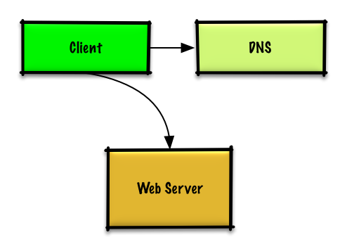
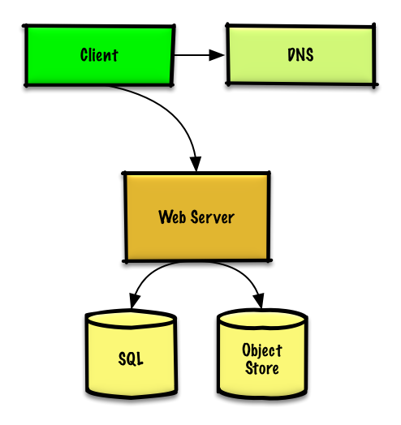
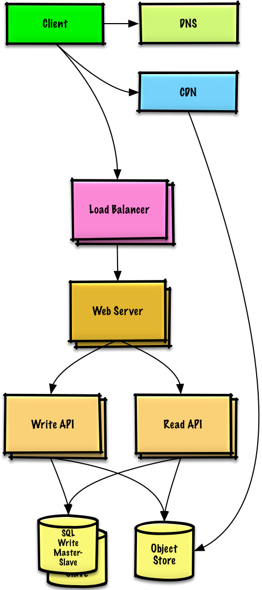
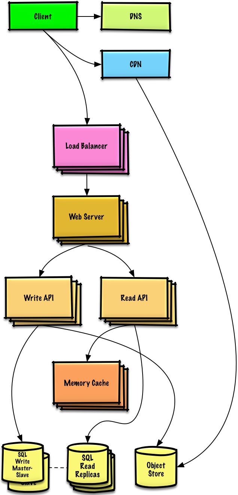
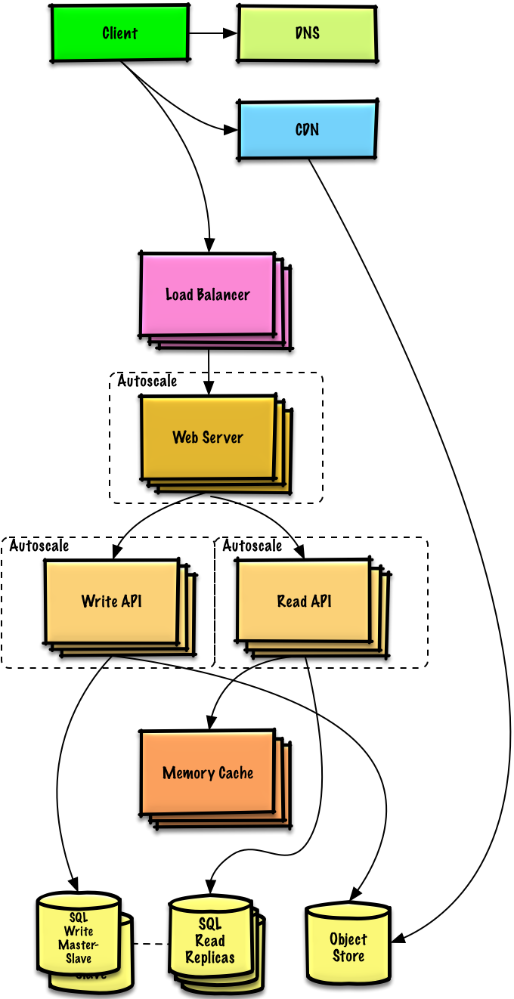

# Design a system that scales to millions of users on AWS. 

## Step 1: Outline use cases and contraints

### Use Cases 

Solving this problem takes an iterative approach of: 

1. Benchmark/Load Test
2. Profile for bottlenecks 
3. Address bottlenecks (while evaluating alternatives and trade-offs)
4. Repeat. 

**We'll scope the problem to handle only the following use cases:**

- **User** makes a read or write request 
    - **Service** does processing, stores user data, then returns the result. 

- **Service** needs to evolve from serving a small amount of users to millions of users. 
    - Discuss general scaling patterns as we evolve an architecture to handle a large number of users and requests 

- **Service** has *high availability*. 

### Constraints and Assumptions 

**State Assumptions:** 

- Traffic is not evenly distributed. 
- Need for relational data. 
- Scale from 1 user to tens of millions of users. 
    - Denote increase of users as: 
        - Users+ 
        - Users++ 
        - Users+++ and so on..
    - 10 million users 
    - 1 billion writes per month 
    - 100 billion reads per month 
    - 100:1 read to write ratio 
    - 1 KB content per write. 

**Calculate Usage:**

- 1 TB of new content per month 
    - 1 KB per write * 1 billion writes per month 
    - 36 TB of new content in 3 years 
    - Assume most writes are from new content instead of updates to existing ones. 

- 400 writes per second on average 
- 40,000 reads per second on average

## Step 2: Create a high level design

## Step 3: Design core components

### Use Case: User makes a read or write request 

#### Goals: 
- With only 1-2 users, you only need a basic setup. 
    - Single box for simplicity. 
    - Vertical scaling when needed. 
    - Monitor to determine bottlenecks. 

#### Start with a single box:
- **Web Server** on EC2 
    - Storage for user data 
    - **MySQL Database**

#### Use Vertical Scaling: 
- Simply choose a bigger box. 
- Keep an eye on metrics to determine **how to scale up**. 
    - Use basic monitoring to determine bottlenecks: CPU, memory, IO, network, etc. 
    - **CloudWatch**, top, nagios, statsd, graphite, etc.\
- **Scaling vertically can get very expensive**
- No redundancy/failover. 

**Trade-offs, alternatives, and additional details:** 
- The alternative to Vertical Scaling is **Horizontal Scaling**. 

#### Start with SQL, consider NoSQL:

The constrains assume there is a **need for relational data**.

We can start off using a **MySQL Database** on the single bnox. 

**Trade-offs, alternatives, and additional details:** 
- Why RDBMS ? 
- Discuss reasons to use **SQL or NoSQL**

#### Assign a public static IP: 

- Elastic IPs provide a public endpoint whose IP doesn't change on reboot. 
- Helps with failover, just point the domain to new IP. 

#### Use a DNS

Add a **DNS** such as Route 53 to **map the domain to the instance's public IP**.

**Trade-offs, alternatives, and additional details:** 
- See DNS section. 

#### Secure the Web Server: 

- Open up only necessary ports. 
    - Allow the web server to respond to incoming requests from: 
        - **80 for HTTP** 
        - **443 for HTTPS** 
        - **22 for SSH to only whitelisted IPs** 
    - Prevent the web server from initiating outbound connections 

**Trade-offs, alternatives, and additional details:**  
- See Security Sections (TSL, SSL)

## Step 4: Scale the Design 

### Users+ 

#### Assumptions 

Our user count is starting to pick up and the load is increasing on our single box. 

Our Benchmarks/Load Tests and Profiling are pointing to **the MySQL Database taking up more and more memory and CPU resources, while the user content is filling up disk space**.

We've been able to address these issues with **Vertical Scaling** so far. Unfortunately, this has become **quite expensive and it doesn't allow for independent scaling of the MySQL Database and Web Server**.

#### Goals:

- **Lighten load on the single box and allow for independent scaling**. 
    - **Store static content separately in an Object Store**
    - **Move the MySQL Database to a separate box**

- **Disadvantages:**
    - These changes would **increase complexity and would require changes to the Web Server to point to the Object Store and the MySQL Database**
    - **Additional security measures must be taken to secure the new components**
    - AWS costs could also increase, but should be weighed with the costs of managing similar systems on your own

#### Store static content separately 

- Consider using a managed **Object Store like S3** to store static content
    - Highly scalable and reliable
    - Server side encryption
- **Move static content to S3**
    - User files
    - JS
    - CSS
    - Images
    - Videos

#### Move the MySQL database to a separate box:

- Consider using a service like **RDS** to manage the MySQL Database. 
    - Simple to administer, scale
    - Multiple availability zones
    - Encryption at rest 

#### Secure the system 

- **Encrypt data in transit and at rest**
- Use a Virtual Private Cloud
    - **Create a public subnet for the single Web Server so it can send and receive traffic from the internet**
    - **Create a private subnet for everything else, preventing outside access**
    - Only open ports from whitelisted IPs for each component
- These same patterns should be implemented for new components in the remainder of the exercise

### Users++ 

#### Assumptions

Our **Benchmarks/Load Tests** and **Profiling** show that our single **Web Server** bottlenecks during peak hours, resulting in slow responses and in some cases, downtime. 

As the service matures, we'd also like to move towards higher **availability and redundancy**

#### Goals:

- The following goals attempt to address the scaling issues with the **Web Server** 
    - Based on the **Benchmarks/Load Tests** and **Profiling**, you might only need to implement one or two of these techniques. 

- Use **Horizontal Scaling** to **handle increasing loads and to address single points of failure**. 
    - Add a **Load Balancer** such as **Amazon ELB** or **HAProxy**. 
        - ELB is highly available. 
        - If you are configuring your own **Load Balancer**, setting up multiple servers in **active-active** or **active-passive** in multiple availability zones will improve availability (See **CAP Theorem**).
        - **Terminate SSL** on the **Load Balancer** to **reduce computational load on backend servers** and to **simplify certificate administration**. 
    - Use mulitple **Web Servers** spread out **over multiple availability zones**.
    - Use multiple **MySQL** instances in **Master-Slave Failover** mode across multiple availability zones **to improve redundancy**.

- Separeate out the **Web Servers** from the **Application Servers**
    - Scale and configure both layers independently. 
    - **Web Servers** can run as **Reverse Proxy** 
    - For example: you can add **Application Servers** handling **Read APIs** while others handle **Write APIs**

- Move static (and some dynamic) content to **Content Delivery Network (CDN)** such as **CloudFront** to **reduce load and latency**.

### Users+++ 

**Note: Internal Load Balancers not shown to reduce clutter**

#### Assumptions 

Our **Benchmarks/Load Tests** and **Profiling** show that we are **read-heavy (100:1 with writes)** and our database is suffering from poor performance from the high read requests.

#### Goals: 

- The following goals attempt to address the scaling issues with the **MySQL Database**
    - Based on **Benchmarks/Load Tests** and **Profiling**, you might only need to implement one or two of these techniques. 

- Move the following data to **Memory Cache** such as **Elasticache** to reduce load and latency: 
    - Frequently accessed content from **MySQL**
        - First, try to configure the **MySQL Database** cache to see if that is sufficient to relieve the bottleneck before implementing a **Memory Cache** 

    - **Session data** from the **Web Servers**
        - The **Web Servers** become **stateless**, allowing for **Autoscaling**. 

    - Reading 1 MB sequentially from memory takes about 250 microseconds, while reading from SSD takes 4x and from disck takes 80x longer. 

- Add **MySQL Read Replicas** to reduce load on **write master**. 
- Add more **Web Server** and **Application Servers** to improve responsiveness. 

#### Add MySQL Read Replicas 

- In addition to adding and scaling a **Memory Cache**, **MySQL Read Replicas** can also help relieve load on the **MySQL Write Master**. 

- Add logic to **Web Server** to separate out writes and reads. 

- Add **Load Balancers** in front of **MySQL Read Replicas** (not pictured to reduce clutter)

- Most Services are **read-heavy** vs write-heavy

### Users++++ 

#### Assumptions 

Our **Benchmarks/Load Tests** and **Profiling** show that our traffic spikes during regular business hours in the U.S. and drop significantly when users leave the office.  

We think **we can cut costs by automatically spinning up and down servers based on actual load**.

We're a small shop so we'd like to automate as much of the DevOps as possible for **Autoscaling** and for the general operations. 

#### Goals: 

- Add **Autoscaling** to provision capacity as needed. 
    - Keep up with traffic spikes 
    - Reduce costs by powering down unused instances. 

- Automate DevOps 
    - **Chef**, **Puppet**, **Ansible**, etc 

- Continue monitoring metrics to adress bottlenecks 
    - **Host Level** - Review a single EC2 instance 
    - **Aggregate Level** - Review load balancer stats 
    - **Log Analysis** - CloudWatch, CloudTrail, Loggly, Splunk, Sumo 
    - **External site performance** - Pingdom, New Relic 
    - **Handle Notifications and incidents** - PagerDuty 
    - **Error Reporting** - Sentry

#### Add Autoscaling: 

- Consider a managed service such as **AWS Autoscaling**
    - Create one group for each **Web Server** and one for each **Application Server** type, place each group in **multiple availability zones**
    - Set a min and max number of instances
    - Trigger to scale up and down through **CloudWatch**
        - Simple time of day metric for predictable loads or
        - Metrics over a time period:
            - CPU load
            - Latency
            - Network traffic
            - Custom metric
    - Disadvantages
        - Autoscaling can introduce complexity
        - It could take some time before a system appropriately scales up to meet increased demand, or to scale down when demand drops

### Users+++++ 

