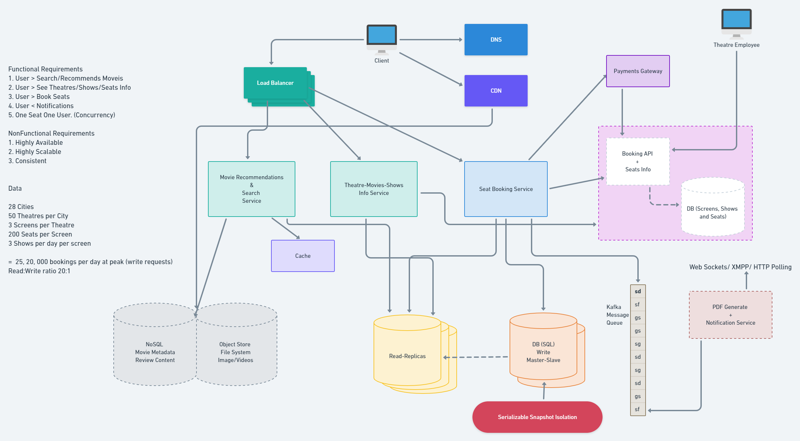

# Design BookMyShow or Fandango 

## Design should have 3 Key things:

1. **Highly Scalable**
2. **Highly Available** 
3. **Fault Tolerant**

## Functional Requirements 

1. Should List cities with theatres. 
2. User selects city > display movies released. 
3. Use selectes movie > lists cinemas runnign movies and available shows (time)
4. User selects a show at a theatre > book the ticket (payment gateway)
5. Send copy of ticket via email (pdf)

6. Movie suggestions when login (Hadoop Spark streamind with ML for recommendation engine) Real-time notification for new releases. 
7. Display Seating arrangement. 
8. User can select multiple seats 
9. User holds seat for 5-10 minutes before finilizing payment. 
10. Portal serves ticket in First-In-First-Out manner. 
11. Comments and Ratings (Cassandra)
12. Highly concurrent (multiple booking requests for same seat at the same time)
13. Financial transaction means System should be secure and ACID compliant. 
14. Movie info (trailer videos, poster images, metadata)

## How To Get Seat Availability Information ? 

1. The **aggregators** can connect to the theatre's DB directly and get the information from the database table. 
    Then this information can be cached and displayed to the user. 

2. Use the theatre's server API to get the avilabile seat information and book the tickets. 

## How to Deal with Concurrent requests for same Seat ??

1. Use some isolations level (**Serializable Snapshot Isolation**) at theatre's db level. 
2. Have two levels of booking:
    1. Seat reserved - Payment pending.
    2. Seat booked - Payment done. 

## Database Choice: 

We need to use both **RDBMS** and **NoSQL** for different purposes. 

1. **RDBMS**: We need **ACID** compliance in our system (**Transactions**). 
    We also have cities, theatres in city, multiple screens in theatre, multiple seats in each screen. **Clear Relationships**. 

2. **NoSQL**: Huge amount of metadata, like **movie description, info**, **review contents**. (Too much data, RDBMS can't handle yo!)
**Cassandra** is a good choice. 

## Async Workers: 

We need workers to generate **PDF** or **Images** of the tickets. 
Also we need **Push Notifications** 

These tasks cannot be executed synchronously. 

As soon as the app server confirms booking of the tickets, it will send the message to the **Message Queue**, a **free worker** will pick up the task, execute it asynchronously and provide notifications to users. 

**RabbitMQ** or **Kafka** can be used for **Message Queueing System**.

For notifications we can use **HTTP long polling**, **Web Sockets** or **XMPP with Jingle**.

**GCM** (google/android) and **APN** (apple) can also be used for push notifications. 

