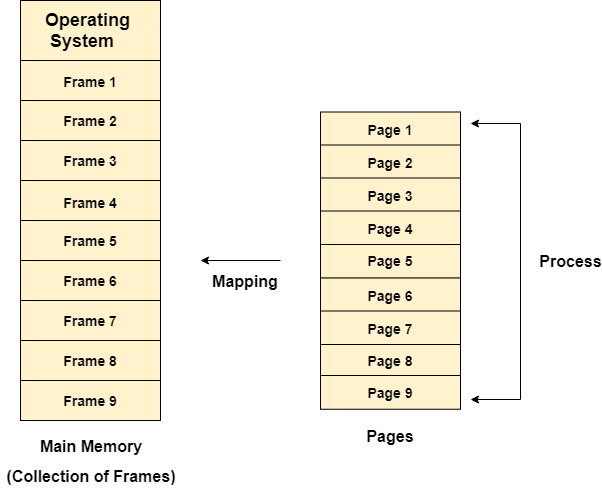
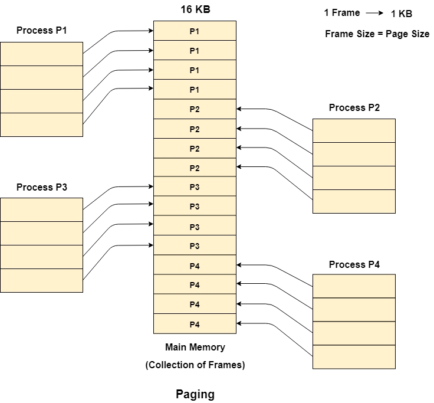
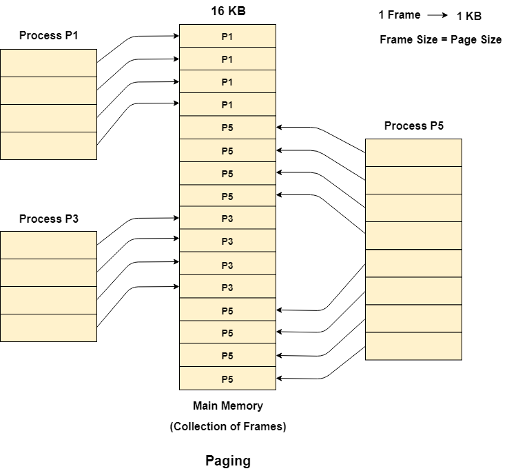

## Paging 

In **Operating Systems**, **Paging** is a **storage mechanism** used to **retrieve processes** from the **secondary storage** into the **main memory** in form of **pages**. 

The main idea behind the **paging** is to **divide each processs in form of pages**. 

The **main memory** will also be **divided** in the form of **Frames**. 

**One page of the process is to be stored in one of the frames of the memory**. 

The **pages can be stored at different locations of the memory** but the **priority is always to find the contiguous frames or holes**.

Pages of the process are **brought into the main memory only when they are required** otherwise they reside in the secondary storage. 

Different operating system defines different **frame sizes**. 

**The sizes of each frame must be equal.**

Since **pages are mapped to the frames** in Paging, **page size needs to be same as frame size.**

## Example 

Let us consider the main memory size 16 Kb and **Frame size is 1 KB** therefore the main memory will be divided into the collection of **16 frames of 1 KB each**.

There are 4 processes in the system that is P1, P2, P3 and P4 of 4 KB each. **Each process is divided into pages of 1 KB each so that one page can be stored in one frame**.

Initially, all the frames are empty therefore pages of the processes will get stored in the contiguous way.

Frames, pages and the mapping between the two is shown in the image below.

Let us consider that, **P2 and P4 are moved to waiting state after some time**. **Now, 8 frames become empty and therefore other pages can be loaded in that empty place**. The process P5 of size 8 KB (8 pages) is waiting inside the **ready queue**.

Given the fact that, we have 8 non contiguous frames available in the memory and paging provides the flexibility of storing the process at the different places. Therefore, **we can load the pages of process P5 in the place of P2 and P4**.

## Memory Management Unit 

The purpose of **Memory Management Unit (MMU)** is to **convert the logical address into the physical address**. The **logical address is the address generated by the CPU for every page** while the **physical address is the actual address of the frame where each page will be stored**.

When a **page is to be accessed by the CPU by using the logical address**, **the operating system needs to obtain the physical address to access that page physically**.

The logical address has two parts.
1. **Page Number**
2. **Offset**

**Memory management unit of OS needs to convert the page number to the frame number**.

**Example:**

Considering the above image, let's say that the CPU demands 10th word of 4th page of process P3. Since the page number 4 of process P1 gets stored at frame number 9 therefore the 10th word of 9th frame will be returned as the physical address.

_See Virtual Memory Next_