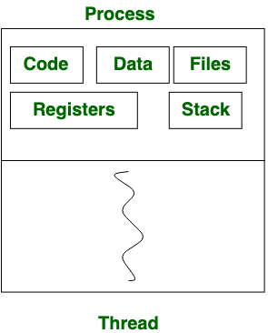
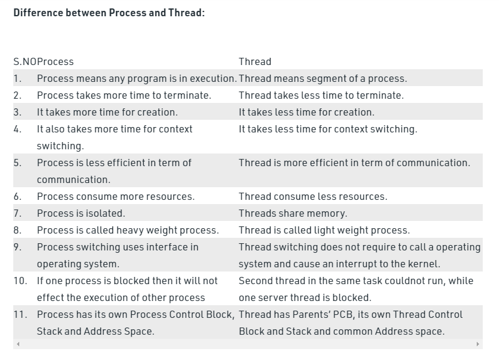

# Process vs Thread 

## Process: 

**Process** means **any program is in execution**. 

**Process Control Block(PCB)** controls the operation of any process. 

**PCB** contains information about processes for example **process priority, process id, process state, CPU, register**, etc. 

A **process** can **creates other processes** which are known as **Child Processes**. 

**Process takes more time to terminate** and **it is isolated means it does not share memory with any other process**.

The process can have the following states like **new, ready, running, waiting, terminated, suspended**

## Thread 

**Thread** is the **segment of a process** means **a process can have multiple threads and these multiple threads are contained within a process**. 

A thread have 3 states: **running, ready, and blocked.**

**Thread** is also known as a **lightweight process**. 

**Thread takes less time to terminate** as compared to process but unlike process **threads do not isolate**. 

**When a Program is executing we call it a Process.**

**A Process can spawn multiple threads**

**One Process can have multiple threads running in multiple CPU cores.**

**Threads are managed by a Scheduler**. 