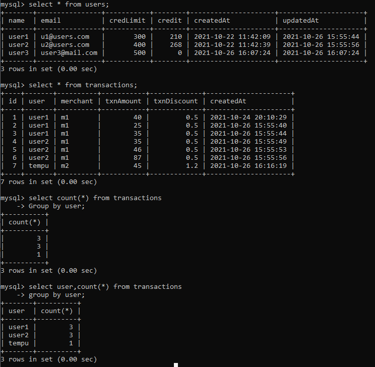

# SQL Topics 


## Referential Integrity: 

**Referential Integrity** is a property of data stating that **all of its references are _valid_**. 

In **SQL** (**Structured Query Language**), A table (called the referencing table) can **refer to a column** (or a group of columns) in another table (the referenced table) by using a **foreign key**.

The referenced column(s) in the referenced table must be under a **unique** constraint, such as a **primary key**. 

On inserting a new row into the referencing table, the **relational database management system** (**RDBMS**) **checks if the entered key value _exists_ in the referenced table**. If not, no insert is possible.


A referential integrity constraint is also known as **foreign key constraint**.

**A foreign key is a key whose values are derived from the Primary key of another table.**

The table from which the values are derived is known as **Master or Referenced Table** and the Table in which values are inserted accordingly is known as **Child or Referencing Table**.

Example: 
```sql 
CREATE TABLE Orders (
    OrderID int NOT NULL AUTO_INCREMENT, 
    OrderNumber int NOT NULL,
    PersonID int, 
    PRIMARY KEY (OrderID)
    FOREIGN KEY (PersonID) REFERENCES Persons(PersonID)
);
```

Adding Foreign Key Later: 
```sql 
ALTER TABLE Orders 
ADD FOREIGN KEY (PersonID) REFERENCES Persons(PersonID);
```

Inserting Into Orders: 
```sql 
INSERT INTO Orders (OrderNumber, PersonID) Values(42, 24);
```

### There are two referential integrity constraint: 

1. **Insert Constraint**: Value cannot be inserted in **CHILD Table** **if the value is not lying in** the **MASTER Table**. 

2. **Delete Constraint**: Value cannot be deleted from **MASTER Table** if the value is lying in **CHILD Table**. 

You'll get error **"Foreign key Constraint Violated"** if you voilate above two. 


## JOINs in SQL: 

A **JOIN** clause is used to combine rows from two or more tables, based on a related column between them. 

Example: 

Orders Table: **OrderID (pk), CustomerID (fk), OrderDate** 

Customers Table: **CustomerID (pk), CustomerName, ContactName, Country**

we can create the following SQL statement (that contains an INNER JOIN), that selects records that have matching values in both tables:

```sql 
SELECT Orders.OrderID, Customers.CustomerName, Orders.OrderDate 
FROM Orders
INNER JOIN Customers ON Orders.CustomerID=Customers.CustomerID; 
```

Output Table: **OrderID, CustomerName, OrderDate**

OR 

```sql 
SELECT OrderID, CustomerName, OrderDate from Orders, Customers
WHERE Customers.CustomerID = Orders.CustomerID; 
```

### Types Of SQL JOINs: 

1. **(INNER) JOIN**: Returns records that have matching values in both tables. 

2. **LEFT (OUTER) JOIN**: Returns records from the left table, and the matched records from the right table. 

3. **RIGHT (OUTER) JOIN**: Returns all records from the right table, and the matched records from the left table. 

4. **FULL (OUTER) JOIN**: Returns all records when there is a match in either left or right table. 


### Inner Join: 

The SQL **INNER JOIN** would **return the records where table1 and table2 intersect**.

_table1_ is left side of **ON** and _table2_ is on right side. 

```sql 
SELECT customers.customer_id, orders.order_id, orders.order_date
FROM customers 
INNER JOIN orders
ON customers.customer_id = orders.customer_id
ORDER BY customers.customer_id;
``` 

If there are multiple rows with intersection, resulting table would have every intersection. 


_NOTE: user3 is missing in result set._


### Left Outer Join: 

The SQL **LEFT OUTER JOIN** would **return the all records from table1** and **only those records from table2 that intersect with table1**.

_table1_ is left side of **ON** and _table2_ is on right side.

```sql 
SELECT customers.customer_id, orders.order_id, orders.order_date
FROM customers 
LEFT OUTER JOIN orders
ON customers.customer_id = orders.customer_id
ORDER BY customers.customer_id;
```

In some databases, the **OUTER** keyword is omitted and written simply as LEFT JOIN.


_NOTE: user3 IS present in result set._


### Right Outer Join: 

The SQL **RIGHT OUTER JOIN** would **return the all records from table2 and only those records from table1 that intersect with table2**.

_table1_ is left side of **ON** and _table2_ is on right side.

```sql 
SELECT customers.customer_id, orders.order_id, orders.order_date
FROM customers 
RIGHT OUTER JOIN orders
ON customers.customer_id = orders.customer_id
ORDER BY customers.customer_id;
```

_I added a transaction with non existing user **tempu** just for example_


_NOTE: tempu transactions is included even when there is no user on **left** table._


### Full Outer Join: 

The SQL **FULL OUTER JOIN** would **return the all records from both table1 and table2**.

```sql
SELECT customers.customer_id, orders.order_id, orders.order_date
FROM customers 
FULL OUTER JOIN orders
ON customers.customer_id = orders.customer_id
ORDER BY customers.customer_id;
```

_NOTE: There is no FULL OUTER JOIN in MySQL, use below alternative_ 

```sql 
SELECT * FROM customers
LEFT JOIN orders ON customers.customer_id = orders.customer_id
UNION
SELECT * FROM orders
RIGHT JOIN customers ON customers.customer_id = orders.customer_id
```

## Multiple Joins: 

You can perform **multiple levels of JOINs** 

```sql 
SELECT customers.customer_id, orders.order_id, orders.order_date, vendors.name 
FROM customers 
INNER JOIN orders 
ON customers.customer_id = orders.customer_id 
INNER JOIN vendors 
ON orders.vendor_id = vendors.vendor_id; 
``` 


## Creating Indexes on SQL Tables: 

**Creates an index on a table. Duplicate values are allowed:**
```sql 
CREATE INDEX index_name
ON table_name (column1, column2, ...)
```

**Creates a _unique_ index on a table. Duplicate values are _not_ allowed:**
```sql 
CREATE UNIQUE INDEX index_name 
ON table_name (column1, column2, ...)
```

Example: 

```sql
CREATE INDEX idx_lastname
ON Persons (LastName);
```

```sql 
CREATE INDEX idx_pname 
ON Persons (LastName, FirstName);
```

**Deleting an Index** 
```sql 
ALTER TABLE Persons
DROP INDEX idx_pname; 
```


## Group By 

The SQL **GROUP BY** clause is used in collaboration with the SELECT statement to **arrange identical data into groups**. 

This **GROUP BY clause follows the WHERE clause** in a SELECT statement and **precedes the ORDER BY** clause.

```sql 
SELECT NAME, SUM(SALARY) FROM CUSTOMERS
GROUP BY NAME;
```



**GROUP BY** simply groups results by **unique elements of a column**.


## Multi-Table Query 

**Instead of using JOINS**, you can also use **aliases** for multi-table queries: 

```sql 
select c.company_code, c.founder, 
    count(distinct l.lead_manager_code), count(distinct s.senior_manager_code), 
    count(distinct m.manager_code),count(distinct e.employee_code) 
from Company c, Lead_Manager l, Senior_Manager s, Manager m, Employee e 
where c.company_code = l.company_code 
    and l.lead_manager_code=s.lead_manager_code 
    and s.senior_manager_code=m.senior_manager_code 
    and m.manager_code=e.manager_code 
group by c.company_code order by c.company_code;
```

This has following alternative with **INNER JOIN**: 

```sql 
select c.company_code, 
    c.founder, 
    count(distinct e.lead_manager_code), 
    count(distinct e.senior_manager_code), 
    count(distinct e.manager_code), 
    count(distinct e.employee_code)
from company c
    inner join employee e on e.company_code = c.company_code
group by c.company_code,c.founder
order by c.company_code;
```


**_This also illustrates what happens when you forget GROUP BY._**
