# ACID Properties of Transactions 

## Atomicity - Consistency - Isolation - Durability

### Atomicity: 

**All changes to data are performed as if they are a single operations.** 

**That is, all the changes are performed, or none of them are.** 

Example: If **debit** is made successfully from one account, the corresponding **credit** should be made to the other account. 

### Consistency: 

**Data is in a consistent state when a transaction starts and when it ends.**

Example: **total value of funds** in both acccounts **is the same** at the **start** and **end** of each transaction. 

### Isolation: 

**The intermediate state of a transaction is invisible to other transactions**. 

**As a result, transaction that run concurrently appear to be serialized.**

Example: **another transaction sees the transferred funds in one account or the other**, but **not in both**, nor in neither.

### Durability: 

**After a transaction successfully completes, changes to data persist and are not undone, even in the event of a system failure.**

Example: the **changes made to each account will not be reversed.** 

## Commit and Rollback 

**To assure the ACID properties of a transaction, any changes made to data in the course of a transaction must be _committed_ or _rolled back_.**

When a transaction **completes normally**, a transaction processing system **commits** the changes made to the data. 

That is, it **makes them permanent** and **visible to other transactions**.

When a transaction **does not complete normally**, the system **roll backs** the changes. 

That is, it **restores the data to its last _consistent_ state**. 

Resources that can be **rolled back** to their **state at the start of a transaction** are known as **Recoverable Resources**. 

Resources that cannot be **rolled back** are **NonRecoverable**. 

# Transactions: Myths, Surprises & Opportunities:

**ACID** is more **mnemonic** than **precise**. 

### Durability: 

In early days **durability** applied to **tapes** (think **cassettes**).

Later it applied to **disks** (**hard disks** are **fragile** too).

Today **durability** means **replication** (think **read-replicas**).

_Not much more to Durability_

### Consistency: 

**Consistency** in **ACID** is **NOT** the **C** in **CAP Theorem**. 

_**C** in **ACID** is kinda **tossed-in** to make the **acronym** work._

The **transactions** the application executes on the database, move the database from **one consistent state to another**. 

**Consistency** here is defined through certain **invariant**. 

Example of **invariant**: Sum of all **credits** must be equal to sum of all **debits**

**Consistency** is the **property** of **how the application uses the database** it's **not a property of the database itself**. 

_Its you who takes care of the Consistency_

### Atomicity: 

In context of **ACID**, **Atomicity** is **NOT** about **Concurrency**. 

**Concurrency** is **dealt with** in the **I** (**Isolation**) of the **ACID** (more about that below).

In context of **ACID**, **Atomicity** is about **how faults are handled**.  

If things **crash** or things **go wrong**, **Atomicity** ensures that either **all of the writes** or **none of the writes** that happen during a transaction, are made. 

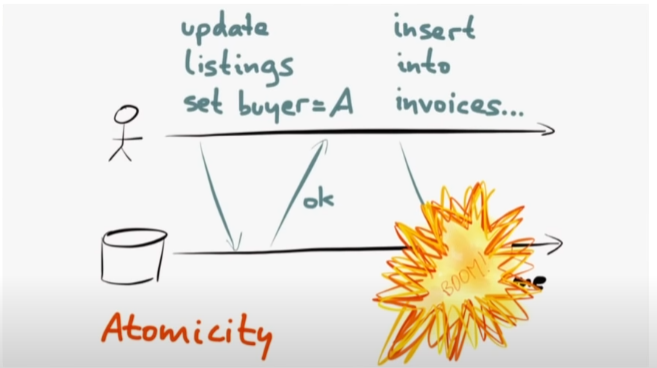

**Transactions** are **about manipulating multiple obect as one** and doing that **as one unit** 

You basically **roll-back** any **partial modifications** in case of an error. 

**Atomicity** should better be called **Abortability**. 

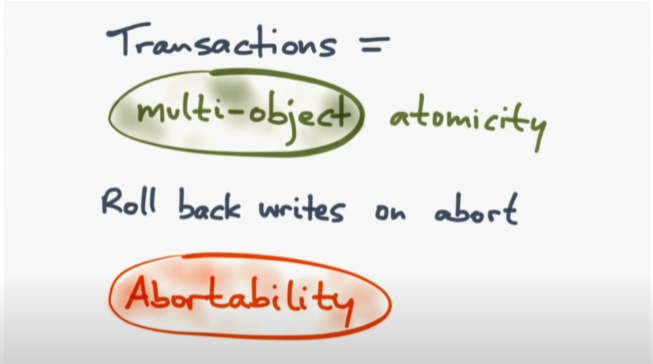

**Abortability** is the **key feature** of a **transaction** because there's always a possibilty that someting might go wrong and we might want to **abort** and **roll back**.  

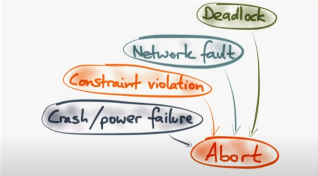

**No matter what happens, just _Abort_ easy.**

_That's all about Atomiciy folks!_

### Isolation: 

**Isolation** is the most **tricky** of all the **ACIDs**.

**Isolations** is often describled as transactions being **Serializable**.

**Serializable** means the **effect of all of their transactions** is **as though they had been executed _serially_ one after another** on the database. 

Each transactions feels like as though **it has the entire database to itself** even though actually what other things might be executing **concurrently**, those concurrent things are **never visible to the transaction**

In practice though there is **Serializable Isolation**, but there also these whole levels of different **Isolation Levels**. 

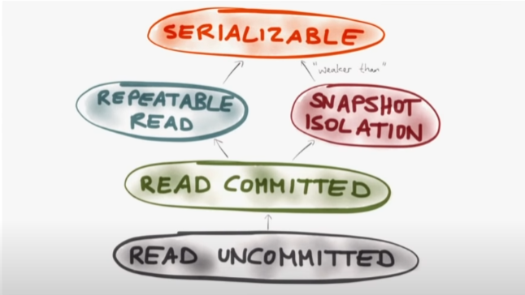

**Serializable Isolation** was quite **slow**. 

So different **lock** implementations were introduced. 

### Read Committed: 

**Default** in **PostGres, Oracle, SQL Servers**

**Read Commit** means that there are **two phenomena** or **two anomalies** that are **not allowed to ever occur** (prevented by the database): _**Dirty Reads** and **Dirty Writes**_

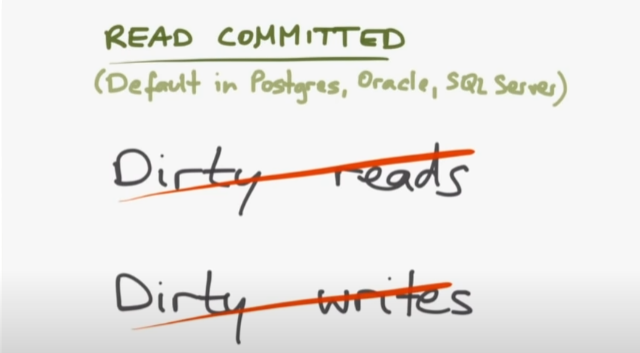

**Dirty Read**: One transaction **reads** data that **another** transaction **has written** but **not yet commited**. 

**Dirty Write**: While one transaction is **writing**, **another** transactions **over-writes** something **before the first one could commit**. Both transactions are now **inconsistent**. 

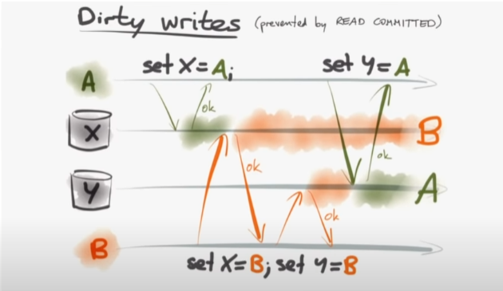

**Read-Committed** **prevents** these two scenarios. 

There is still one **anomality** possible **even with Read-Commited**, **Read-Skew**. 

### Read Skew: 

If a **backup-service** (creating **read-replicas** maybe) is reading a database during a transaction with **Read-Commited Isolation**, there is a possibilty where **backup** might be **inconsistet**. 

Restoring from such a **backup** would lead our DB to be **meaningless**

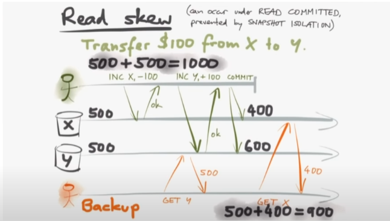

(You've **backed-up** **different parts of database at different times**)

**This can happen with Read-Commited isolation level**. 

To deal with this **Read-Skew** anomaly, **Repeatable-Read** and **Snapshot Isolation** were brought in.

**Snapshot Isolation is more common now-a-days**. Its implemented as **multi-version concurrency control (MVCC)**. 

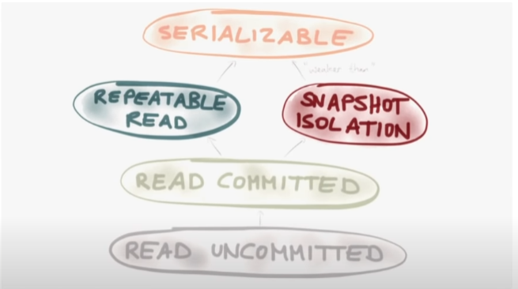

In many cases when databases say **Repeatable-Read** they **actually mean** **Snapshot-Isolation**. 

### Snapshot Isolation: 

The purpose of **Snapshot Isolation** is if you're a transaction that's **reading** the database, **you see the entire database _as it WAS at one point in time_**. 

So even if **other writes** are **subsequently commited**, that (above) **read transaction**, even if it runs for a while, **is not going to see those writes**. 

That's where the **multi-version (of MVCC)** comes in, that means **the database internally keep several different versions for a data item** and it presents the transaction that's appropriate to it (transaction).

### Read Repeated:

**Read Repeat** was used on older systems like **R** or **classic SQL**. 

**Read Repeat** has a **lots of locks**, **reads have to be repeated I guess** 

Default isolation level in **MySQL** is **Read-Repeat**.
In **PostGreSQL** it is **Read-Commited**.

There is STILL one **anomality** possible **even with Read-Repeaded AND Snapshot Isolation**, **Write-Skew**. 

## Write Skew: 

Imagine an **Ambulance Service** where the **invariant** is the **there must always be _ONE_ doctor on-call**. If there are no docters on-call the ambulance cannot go (without a docter).

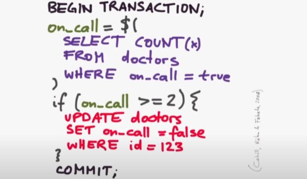

If the doctors use above transaction to **go off-call** (break), the transaction will check how many doctors are **on-call**, if its at-least 2, then **its safe for the doctor to go off-call**.   

With **Snapshot Isolation** or **Read-Repeated**, an anomaly can occur where there are **no doctors on-call**, if the **last two doctors start a transaction at almost same time** and our **invariant has been violated**. 

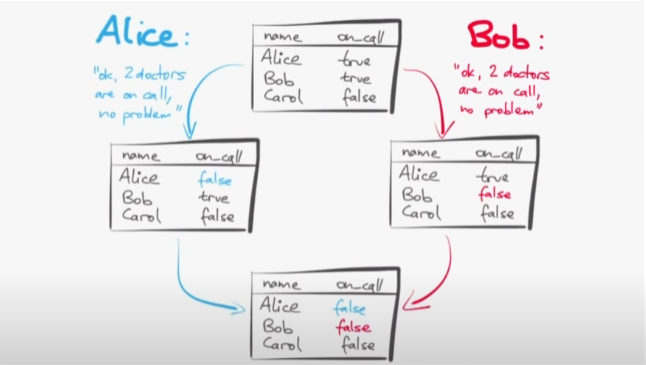

This type of anomaly is known as **Write Skew**. 

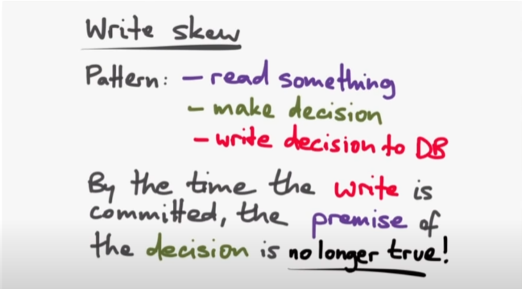

In **concurrent executions of transactions**, by the time the transaction **commits**, the **premise of the decision** that this transaction made (**based on some read**) **may no longer be true**.

This would be a **serializability violation**. 

**Race Condition**: When **two concurrent transacations are working on same data** (even if different **snapshots**)
