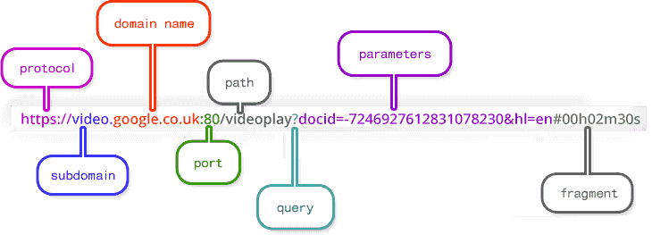

## What happens when we type a URL (www.google.com)

### URL stands for Uniform Resource Locator. 

URL is the address of the website. It is a **reference** to a **resource** on the internet, be it images, hypertext pages, audio/video files, etc. 

1. **The protocol**, also known as the scheme, is the first part of a URL. 
    - It represents the **sets of rules that decide how files are displayed, formatted, or transferred across the web**. For example, when an address is entered in the browser, the **http** part , which stands for **hypertext transfer protocol**, tells it that the page is to be displayed in **hypertext format (HTML)**. 

    - Other protocols include the **file transfer protocol (ftp)** for transferring files and **single mail transfer protocol (SMTP)** for used by mail servers to send emails. 

2. **The subdomain**, The most common subdomain is **‘www’** which a general symbol for any resource on the web. However, it is common to specify the type of resource that the browser should deliver. 

3. **The top level domain (TLD)** is also known as the **domain extension**. It is the **‘com’** that appears at the end of simple websites addresses like bing.com. This part specifies what kind of content will be on the website. **‘.com’ was primarily used for commercial sites** (although today it’s used to indicate any website), whereas **‘.org’** is usually used to indicate that the website is that of an organization. 

4. **The port** is a **reserved channel** used for specific purposes. Different types of servers will use different ports. Web server ports differ from file server ports, for instance. The default port for standard **HTTP servers is 80**, whereas secure websites use **HTTPS which requires port number 443**. (**SSH defaults to Port 22**)

5. **The path** used to show which **directory** on server stores the resources (files, videos, audio, etc.) that are being requested. Nowadays, the path that appears in most URLs these days don’t forcibly reflect the directory structure on the server. Instead, **paths are used to identify a route in the navigational structure of the website**.

### IP Addresses 

An **IP address** is a unique address that **identifies a device on the internet or a local network**. IP stands for **"Internet Protocol"**, which is the set of rules governing the format of data sent via the internet or local network.

An IP address is a **string of numbers separated by periods**. IP addresses are expressed as a **set of four numbers** — an example address might be **192.158.1.38**. Each **number in the set can range from 0 to 255**. So, the full IP addressing range goes from 0.0.0.0 to 255.255.255.255.

### DNS

**DNS** (**Domain Name System**) **maintains and maps** the name of the website, ie: **URL**, and particule **IP** (**Internet Protocol**) address it links to. 

Every **URL** on the internet has a unique **IP** address which is **of the computer which hosts the server of the website requested**.

### What happens whe we enter a URL: 

1. Browser checks (its own) **cache** for **DNS** entry to find the corresponding **IP address** of website. 

    It looks for the following cache. If not found in one, then continues checking to the next until found. 
        - Browser Cache 
        - Operating Systems Cache 
        - Router Cache 
        - **ISP** Cache

2. If not found in cacne, **ISP's (Internet Service Provider) DNS server** initiates a **DNS query** to find **IP address** of server that hosts the domain name.
    
    **The requests are sent using small data packets** that contain information content of request and **IP address** it is destined for. 

3. Browser initiates a **TCP (Transfer Control Protocol)** connection with the server using synchronize(**SYN**) and acknowledge(**ACK**) messages. 

4. Browser sends an **HTTP** request to the web server. **GET** or **POST** request. 

5. Server on the host computer **handles that request and sends back a response**. It assembles a response in some format like **JSON, XML and HTML**.

6. Server sends out an **HTTP response** along with the **status of response**. 

7. Browser displays **HTML** content. 

8. Browser may send more requests for additional objects embedded in the **HTML** like images, css, javascript. 

8. Finally Done....