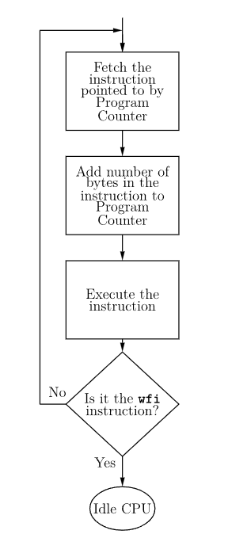

# How Does A Program Execution Works 

## Kernel Level 

A **modern CPU** has (at leat) **two modes**, a mode in which it's running the core of the Operating System itself (**Kernel Mode**), and a mode in which it's running programs (**User Mode**). 

When in **User Mode**, the **CPU** can't do a whole lot of things. 

For instance, **a mouse click is typically noticed in the kernel**, **not user mode**. However, the **OS dispatches the event to user mode** and from there to **the correct program**.

The other way around also requires cooperation: **a program can't draw to the screen freely**, but **needs to go through the OS and kernel mode to draw on its part**.

Similarly, **the act of starting a program is typically a _cooperation_**. 

The **shell part of the OS is a user-mode program too**. It gets your mouse click, and determines that it's **a mouse click (or command) intended to start a process**. The shell then **tells the kernel-mode part of the OS to start a new process for that program**.

When the **kernel mode needs to start a new process**, it **first allocates memory for bookkeeping**, and **then proceeds to load the program**. 

This involves **retrieving the instructions from the binary**, but **also hooking up the program to the OS**. 

This usually **requires finding the entry point (classically _main(args []string)_) of the binary**, and **all points where the program wants to call the OS.**

_Different Operating Systems use different ways to hook up programs with the OS_. 

As a result, the loading process differs, and the **file formats for binaries can differ too**. It's not absolute; the **ELF format for binaries is used for a number of Operating Systems**, and **Microsoft uses its PE format** on all its current Operating Systems. 

**Linux can't run Window's PE format, Windows can't run Linux's ELF format.**

## Program Execution in the CPU

The **CPU contains a special register**, the **_Instruction Register_** which **holds the next instruction that the CPU will execute**. 

Once the **instruction has been _executed_, a _new instruction_ will be loaded onto the Instruction Register**

Several instructions are waiting in a **queue**, ready to be executed. 

Instructions are fetched from several **different program's (or thread's)** instruction queues and placed on the main **execution queue** 

The "**Program Counter (PC)**", which is sometimes called the **Instruction Pointer (IP)**, is what **allows the Thread to keep track of the next instruction to execute**.

In most processors, the **PC** **points to the "next instruction" and _NOT_ the current instruction**.

The **computer keeps track of the next line to be executed by keeping its ADDRESS in the special register called the "Instruction Pointer" (IP) or "Program Counter" (PC)**

The **Instruction Pointer (IP)** **always has the memory address of (points to) the next instruction to be executed**. **In order for the control unit to execute this instruction, it is copied into the instruction register.**

**The contents of IP/PC is updated with every instruction executed (or fetched onto main queue).**

_Thus a program is executed sequentially line by line._

**In Go stack trace**, **the small hexadecimal numbers at the end of each line (like: +0x39 or +0x72) represent the PC/IP value offset from the top of the respective function.**

**The Execution Happens As Follows:**

1. **A sequence of instructions is stored in memory.**

2. **The memory address where the first instruction is located is copied to the program counter.**

3. **The CPU sends the address in the program counter to memory via the _Address Bus_.**

4. **Memory responds by sending a copy of instructions (32 or 64 bits) at that memory location on the data bus, which the CPU then copies into its instruction register**.

5. **The instruction pointer is automatically incremented to contain the address of the next instruction in memory.**

6. **The CPU executes the instruction in the instruction register.**

7. Go to step **3**.

Steps **3,4 and 5** are called an **instruction fetch**. 

Notice that steps **3 – 7** make up a **cycle**, the **instruction execution cycle**.

**wfi** is **wait for interrupt**, **wfi** places the **CPU** in an idle state, where it remains until an **I/O device sends an interrupt signal** to the CPU.

## How Are Instructions Loaded Into Memory ? 

_See Paging_ 

## How Are Binaries Created in Disk Storage ? 

1. A **Compiler** or **Assembler** is used to create **Object Files** by **compiling** a **Source File** 

2. A **Linker** is used to create an **Executable File** or **Binaries**. 

_See OS Scheduler & GO Scheduler Next_

# Inter-Process Communication Methods: 

**Inter-process communication (IPC)** is **set of interfaces**, which is usually programmed in order for the programs to communicate between series of processes. **This allows running programs concurrently in an Operating System.** These are the methods in IPC:

1. **Pipes (Same Process)** –
    This allows flow of data in one direction only. Analogous to simplex systems (Keyboard). Data from the output is usually buffered until input process receives it which must have a common origin.

2. **Names Pipes (Different Processes)** –
    This is a pipe with a specific name it can be used in processes that don’t have a shared common process origin. E.g. is FIFO where the details written to a pipe is first named.

3. **Message Queuing** –
    This allows **messages to be passed between processes using either a single queue or several message queue**. 
    This is **managed by system kernel these messages are coordinated using an API**.

4. **Shared memory** –
    This allows the **interchange of data through a defined area of memory**. **Semaphore** values have to be obtained before data can get access to shared memory.
    **Semaphores** is used in **solving problems associated with synchronization and to avoid race condition**. These are integer values which are greater than or equal to 0.

5. **Sockets** –
    This method is mostly **used to communicate over a network between a client and a server**. It allows for a standard connection which is computer and OS independent.

_Move This To Processes vs Threads_