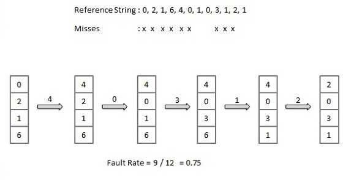
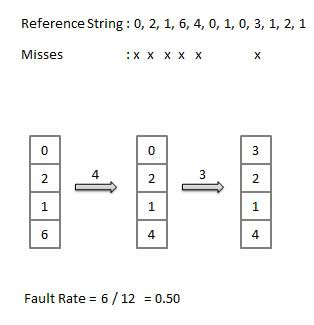
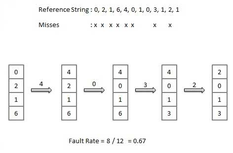

## Virtual Memory in Operating System

**Virtual memory** is a feature of an operating system that enables a computer to be able to **compensate shortages of physical memory by transferring pages of data from random access memory to disk storage**.

This process is done temporarily and is designed to work as a combination of RAM and space on the hard disk.

This means that **when RAM runs low, virtual memory can move data from it to a space called a paging file**. This process allows for RAM to be freed up so that a computer can complete the task.

Virtual memory **frees up RAM** by **swapping data that has not been used _recently_ over to a storage device**, such as a hard drive or solid-state drive (SSD).

Occasionally a user might be shown a message that says the virtual memory is running low, this means that either more RAM needs to be added, or the size of the paging file needs to be increased.

If the OS has to **swap data between virtual memory and RAM too often**, the computer will begin to **slow down** -- this is called **_thrashing_**.

**Virtual Memory is a storage allocation scheme in which secondary memory (HDD SSD) can be addressed as though it were part of the main memory (_RAM_)**

The main visible advantage of this scheme is that programs can be larger than physical memory.

**Virtual memory serves two purposes:** 

1. First, it allows us to **extend the use of physical memory by using disk**. 

2. Second, it **allows us to have memory protection, because each virtual address is translated to a physical address**.

Situations, when entire program is not required to be loaded fully in main memory:

- User written error handling routines are used only when an error occurred in the data or computation.

- Certain options and features of a program may be used rarely.

- Many tables are assigned a fixed amount of address space even though only a small amount of the table is actually used.

- The ability to execute a program that is only partially in memory would counter many benefits.

- Less number of I/O would be needed to load or swap each user program into memory.

- A program would no longer be constrained by the amount of physical memory that is available.

- Each user program could take less physical memory, more programs could be run the same time, with a corresponding increase in CPU utilization and throughput.

### Modern microprocessors intended for general-purpose use, a Memory Management Unit, or MMU, is built into the hardware.

The **MMU's** job is to translate virtual addresses into physical addresses. 

**Virtual Memory is commonly implemented by Demand Paging**. 

It can also be implemented in a segementation system. Demand segementation can also be used to provide virtual memory. 

## Demand Paging

The process of **loading the page into memory on demmand (whenever page fault occurs)** is known as **demand paging**. 

**Page Fault** is an **exception** that the memory management unit (**MMU**) raises when a **process accesses a memory page without proper preparations** (_Page not yet loaded into Frame (RAM)_). 

A **demand paging system** is quite similar to a **paging system with swapping** where the **processes reside in secondary memory** and **pages are loaded only on demand, not in advance**.

When a **contenxt switch** occurs, the operating system **does not copy** any of the **old program's pages out to the disk** or any of the **new program's pages into the main memory**. 

Instead, it **just begins executing the new program after loading the first page** and **fetches that program's pages as they are referenced**.

1. If the CPU tries to refer to a page that is currently not available in the main memory, it generates an interrupt indicating a memory access fault. 

2. The OS puts the interrupted process in a **blocking state**. For the execution to proceed the OS mut bring the required page into the memory. 

3. The OS will search for the required page in the logical address space. 

4. The required page will be brought from logical address space to the physical address space. 
    - The **page replacement algorithms** are used for the decision-making of replacing the page in physical address space. 

5. The page table will be updated accordingly.

6. The signal will be sent to the CPU to continue program execution and it will place the process back into the ready state. 

Hence whenever a **page fault** occurs these steps are followed by the operating system and the required page is brought into memory. 

### Advantanges (Demand Paging):

1. Large virtual memory.
2. More efficient use of memory.
3. There is no limit on degree of multiprogramming.'

### Disadvantages (Demand Paging):

1. Number of tables and the amount of processor overhead for handling page interrupts are greater than in the case of the simple paged management techniques.

**Page replacement algorithms** are the techniques using which an Operating System decides which memory pages to swap out, write to disk when a page of memory needs to be allocated. 

**Paging happens whenever a page fault occurs** and a free page cannot be used for allocation purpose accounting to reason that pages are not available or the number of free pages is lower than required pages.

There are many different page replacement algorithms. We evaluate an algorithm by running it on a particular **string of memory reference** and computing the number of page faults.

### Reference String

The **string of memory references** is called **reference string**. 

Reference strings a regenerated artificially or by tracing a given system and recording the address of each memory reference.

The latter choide produces a large number of data, where we note two things: 

1. For a given page size, we need to consider only the page number, not the entire address. 

2. If we have a reference to a page **p**, then any immediately following references to page **p** will never cause a page fault. 
    - Page p will be in memory after the first reference; the immediately following references will not fault.

    - For example, consider the following sequence of addresses − 123,215,600,1234,76,96

    - If page size is 100, then the reference string is 1,2,6,12,0,0

## Page Replacement Algorithms: 

### First In First Out (FIFO) Algorithm: 

1. Oldest page in main memory is the one which will be selected for replacement. 

2. Easy to implement, keep a list, **replace pages from the Tail** and **add new pages at the Head**.

### Optimal Page Algorithm: 

1. An optimal page-replacement algorithm has the **lowest page-fault rate of all algorithms**. An optimal page-replacement algorithm exists, and has been called OPT or MIN.

2. Replace the page that will not be used for the longest period of time. **Use the time when a page is to be used**.

### Least Recently Used (LRU) Algorithm: 

1. Page which has **not been used for the longest time in main memory is the one which will be selected for replacement**.

2. Easy to implement, **keep a list, replace pages by looking back into time**.

### Page Buffering Algorithm: 

1. To get a process start quickly, **keep a pool of free frames**.

2. On page fault, select a page to be replaced.

3. Write the new page in the frame of free pool, mark the page table and restart the process.

4. Now write the dirty page out of disk and place the frame holding replaced page in free pool.

### Least Frequently Used (LFU) Algorithm: 

1. The **page with the smallest count is the one which will be selected for replacement**.

2. This algorithm suffers from the **situation in which a page is used heavily during the initial phase of a process**, but then is never used again.

### Most Frequently Used (MFU) Algorithm: 

1. This algorithm is based on the argument that **the page with the smallest count was probably just brought in and has yet to be used**.

### First In First Out (FIFO) Algorithm 

1. First page that was added in will be the first one to be replaced and so on. 

_See More About Paging_