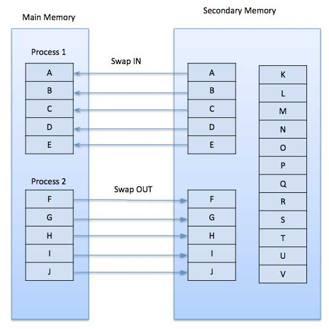

## Virtual Memory in Operating System

**Virtual Memory is a storage allocation scheme in which secondary memory (HDD SSD) can be addressed as though it were part of the main memory (_RAM_)**

The main visible advantage of this scheme is that programs can be larger than physical memory.

**Virtual memory serves two purposes:** 

1. First, it allows us to **extend the use of physical memory by using disk**. 

2. Second, it **allows us to have memory protection, because each virtual address is translated to a physical address**.

Situations, when entire program is not required to be loaded fully in main memory:

- User written error handling routines are used only when an error occurred in the data or computation.

- Certain options and features of a program may be used rarely.

- Many tables are assigned a fixed amount of address space even though only a small amount of the table is actually used.

- The ability to execute a program that is only partially in memory would counter many benefits.

- Less number of I/O would be needed to load or swap each user program into memory.

- A program would no longer be constrained by the amount of physical memory that is available.

- Each user program could take less physical memory, more programs could be run the same time, with a corresponding increase in CPU utilization and throughput.

### Modern microprocessors intended for general-purpose use, a memory management unit, or MMU, is built into the hardware.

The **MMU's** job is to translate virtual addresses into physical addresses. 

**Virtual Memory is commonly implemented by Demand Paging**. 

It can also be implemented in a segementation system. Demand segementation can also be used to provide virtual memory. 

## Demand Paging

The process of **loading the page into memory on demmand (whenever page fault occurs)** is known as **demand paging**. 

A **demand paging system** is quite similar to a **paging system with swapping** where the **processes reside in secondary memory** and **pages are loaded only on demand, not in advance**.

When a **contenxt switch** occurs, the operating system **does not copy** any of the **old program's pages out to the disk** or any of the **new program's pages into the main memory**. 

Instead, it **just begins executing the new program after loading the first page** and **fetches that program's pages as they are referenced**.

1. If the CPU tries to refer to a page that is currently not available in the main memory, it generates an interrupt indicating a memory access fault. 

2. The OS puts the interrupted process in a **blocking state**. For the execution to proceed the OS mut bring the required page into the memory. 

3. The OS will search for the required page in the logical address space. 

4. The required page will be brought from logical address space to the physical address space. 
    - The **page replacement algorithms** are used for the decision-making of replacing the page in physical address space. 

5. The page table will be updated accordingly.

6. The signal will be sent to the CPU to continue program execution and it will place the process back into the ready state. 

Hence whenever a **page fault** occurs these steps are followed by the operating system and the required page is brought into memory. 

### Advantanges (Demand Paging):

1. Large virtual memory.
2. More efficient use of memory.
3. There is no limit on degree of multiprogramming.'

### Disadvantages (Demand Paging):

1. Number of tables and the amount of processor overhead for handling page interrupts are greater than in the case of the simple paged management techniques.

**Page replacement algorithms** are the techniques using which an Operating System decides which memory pages to swap out, write to disk when a page of memory needs to be allocated. 

**Paging happens whenever a page fault occurs** and a free page cannot be used for allocation purpose accounting to reason that pages are not available or the number of free pages is lower than required pages.

There are many different page replacement algorithms. We evaluate an algorithm by running it on a particular **string of memory reference** and computing the number of page faults.